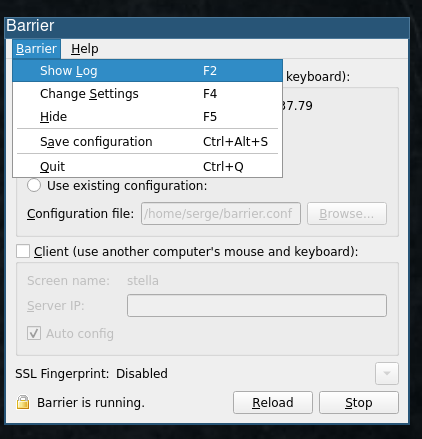

# Getting barrier working between Linux and macOS Monterey


I'm using version 2.4.0 of [barrier](https://github.com/debauchee/barrier) with the host being an ubuntu box (22.04)
and one client being macOS Montery.

Installing barrier on each platform is the usual dmg for mac, followed by
setting access permissions, and `sudo apt
install barrier` on linux.

I couldn't initiall connect the client to the host. 
To debug this I check the barrier logs on the server, which can be accessed as:



This told me I was missing the certificate. I was actually missing the cert on
both the client and the server.

To fix this on the server it was:
```
cd ~/.local/share/ barrier/SSL
openssl req -x509 -nodes -days 365 -subj /CN=Barrier -newkey rsa:4096 -keyout Barrier.pem -out Barrier.pem
```

On the mac:
```
cd ~/Library/Application Support/barrier/ssl
openssl req -x509 -nodes -days 365 -subj /CN=Barrier -newkey rsa:4096 -keyout Barrier.pem -out Barrier.pem
```
With these changes, restarting barrier on the client and the host sorted the connection.


