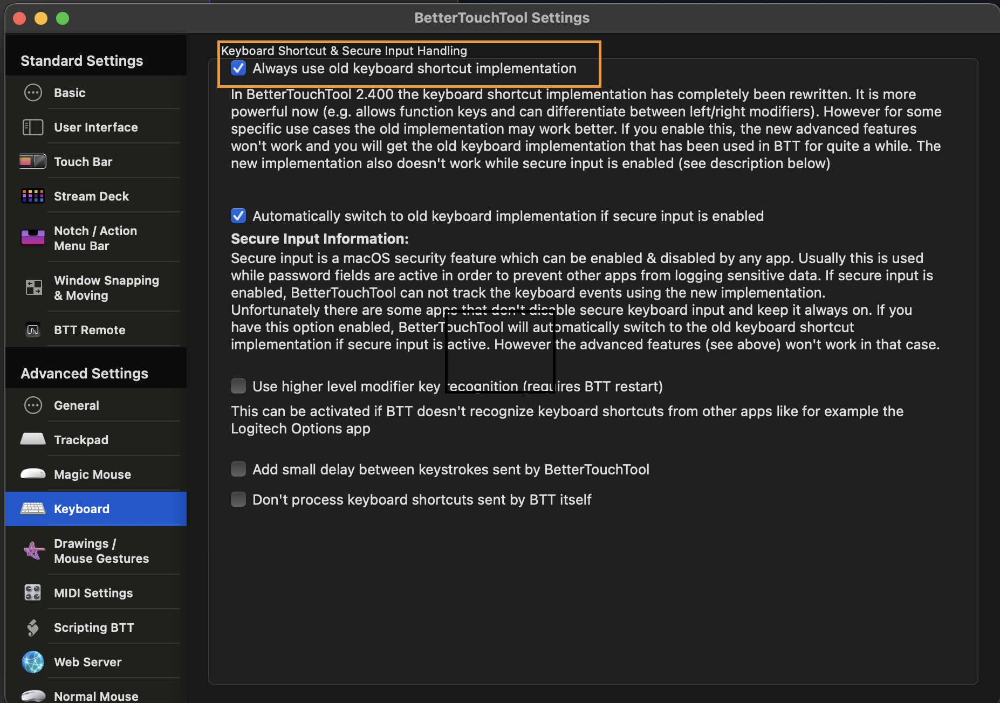

# Fixing bettertouchtool beeping/nonworking keyboard triggers

For a long time, I've been using keybaord triggers via bettertouchtool to jump to different
applications.

A few days ago, these same triggers stopped working and would instead beep when
I tried them.

The solution for me was to select the `Always use the old keyboard shortcut
implementation` which was not selected in settings:

I should note that this started shortly, but not immediately, after a new preset
was installed to replace [bartender](https://github.com/sjsrey/til/blob/main/macosx/menubarbtt.md).

[Source](https://community.folivora.ai/t/keyboard-shortcuts-are-not-working/35799)
