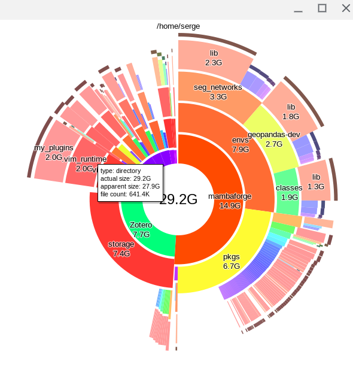

# Dude, where are my bytes?

Want a quick overview of disk usage? [duc](https://duc.zevv.nl/) fits the bill nicely.

```
sudo apt install duc
duc install
# take a short break depending on how large the disk is
duc gui
```

and then you will be looking at something like:


