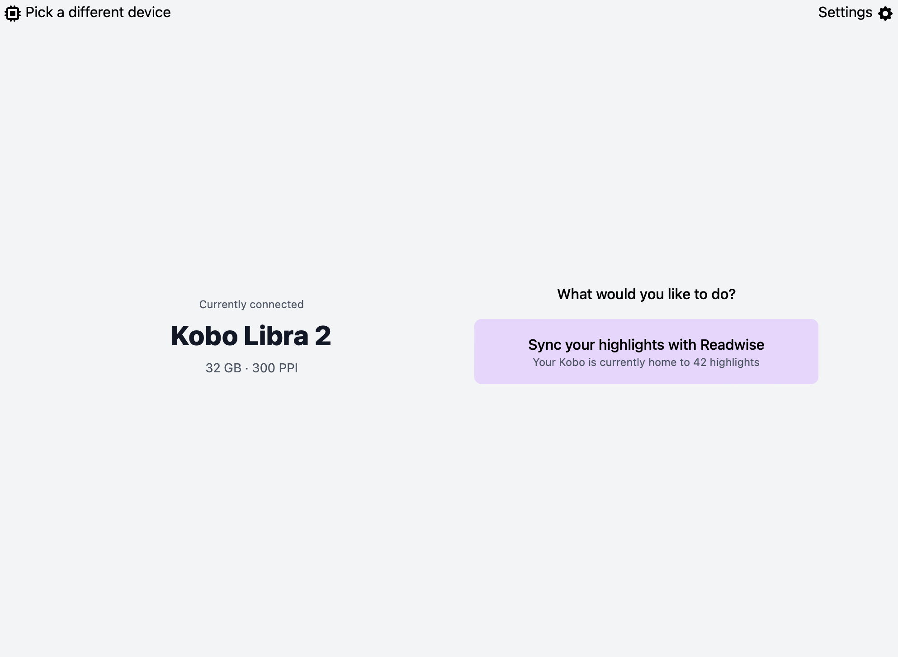

# Extract Kobo Highlights to Readwise

I picked up a
[kobolibra2](https://us.kobobooks.com/collections/ereaders/products/kobo-libra-2?utm_source=google&utm_medium=cpc&utm_campaign=us-device-dsa&gclid=CjwKCAjwzNOaBhAcEiwAD7Tb6AAhWu1imkvWG4rG8l4l1_UbOxagR7I_tvXV6yffCv5oxc_gdfrPtBoCXfQQAvD_BwE) and am actually checking e-books out of my local
library to read on it. Since these are sideloaded, and not purchased through the Kobo store,
extracting the highlights requires a separate application
[october](https://github.com/marcus-crane/october).

To get the sync working:

- [grab readise token](https://readwise.io/access_token)
- Connect your device to your computer
- start `october` and add your readwise token
- select `Sync your highlights with Readwise`

One thing I need to check into is what happens to the highlights on a book
that is returned to the library?

