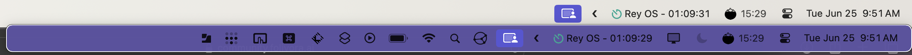

# Menubar hiding with BetterTouchTool

After the [controversy with
Bartendar](https://www.macrumors.com/2024/06/04/bartender-mac-app-new-owner/#:~:text=The%20transaction%20came%20to%20light,of%20transparency%20surrounding%20the%20situation.), I decided to look for an alternative way to manage the icons in my menubar. It looks like [BetterTouchTool](https://community.folivora.ai/t/bartender-controversy-tutorial-on-how-to-manage-menubar-status-items-via-btt/37429/173) is my new menubar manager.

